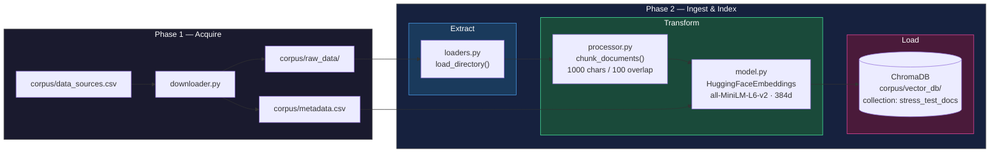
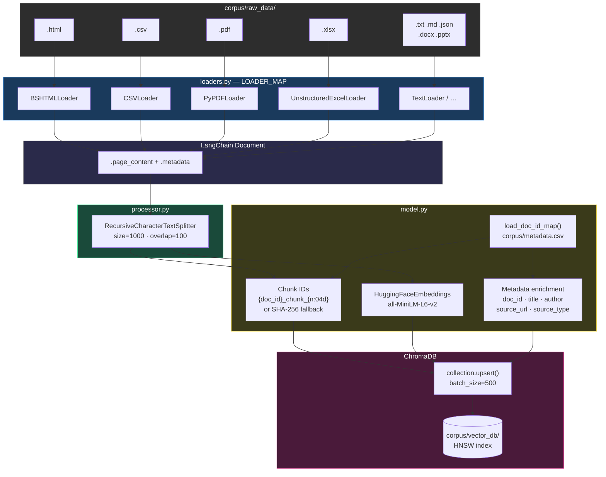
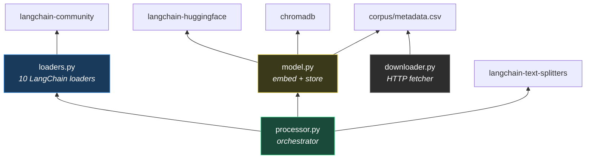

# Architecture

## Project Structure

```text
rag_stress_testing_v1/
├── corpus/
│   ├── data_sources.csv       # URLs to download
│   ├── metadata.csv           # Per-file download metadata (doc_id, title, author, …)
│   ├── raw_data/              # Downloaded files (.html, .csv, .pdf, .xlsx)
│   └── vector_db/             # ChromaDB persistent storage (HNSW index)
├── src/
│   ├── ingestion/
│   │   ├── downloader.py      # Phase 1: download files from data_sources.csv
│   │   ├── loaders.py         # Extract: LangChain Community document loaders
│   │   └── processor.py       # Pipeline orchestrator (load → chunk → embed → store)
│   └── embedding/
│       └── model.py           # Transform + Load: embed via HuggingFace, upsert to ChromaDB
├── tests/
│   ├── test_downloader.py
│   └── test_embedding.py
├── docs/
│   ├── ADR.md
│   ├── architecture.md
│   └── phase_2.md
└── pyproject.toml
```

## Pipeline (ETL)



## Data Flow Detail



## Module Dependency Graph



## 
