# Architecture

## Project Structure

```text
rag_stress_testing_v1/
├── corpus/
│   ├── data_sources.csv       # URLs to download
│   ├── metadata.csv           # Per-file download metadata (doc_id, title, author, …)
│   ├── raw_data/              # Downloaded files (.html, .csv, .pdf, .xlsx)
│   └── vector_db/             # ChromaDB persistent storage (HNSW index)
├── src/
│   ├── utils.py               # RAM-aware embedding model selection
│   ├── ingestion/
│   │   ├── downloader.py      # Phase 1: download files from data_sources.csv
│   │   ├── loaders.py         # Extract: LangChain Community document loaders
│   │   └── processor.py       # Pipeline orchestrator (load → chunk → embed → store)
│   ├── embedding/
│   │   └── model.py           # Transform + Load: embed via HuggingFace, upsert to ChromaDB
│   ├── retrieval/
│   │   └── query.py           # Semantic search: embed query → ANN lookup → ranked results
│   └── generation/
│       └── llm.py             # RAG generation: build prompt → Ollama LLM → grounded answer
├── tests/
│   ├── test_downloader.py
│   ├── test_embedding.py
│   ├── test_retrieval.py
│   ├── test_generation.py
│   └── test_utils.py
├── docs/
│   └── architecture.md
└── pyproject.toml
```

---

## Pipeline (ETL)


---

## Pipeline Sequence Diagram


---

## Data Flow Detail

```mermaid
graph TD
    subgraph Input["corpus/raw_data/"]
        HTML[".html"]
        CSVF[".csv"]
        PDF[".pdf"]
        XLSX[".xlsx"]
        OTHER[".txt .md .json<br/>.docx .pptx"]
    end

    subgraph Loaders["loaders.py — LOADER_MAP"]
        BS4["BSHTMLLoader"]
        CL["CSVLoader"]
        PY["PyPDFLoader"]
        XL["UnstructuredExcelLoader"]
        OL["TextLoader / …"]
    end

    subgraph Documents["LangChain Document"]
        DOC[".page_content + .metadata"]
    end

    subgraph Chunking["processor.py"]
        SPLIT["RecursiveCharacterTextSplitter<br/>size=1000 · overlap=100"]
    end

    subgraph Embedding["model.py"]
        META2["load_doc_id_map()<br/>corpus/metadata.csv"]
        IDS["Chunk IDs<br/>{doc_id}_chunk_{n:04d}<br/>or SHA-256 fallback"]
        EMB["HuggingFaceEmbeddings<br/>all-MiniLM-L6-v2"]
        ENRICH["Metadata enrichment<br/>doc_id · title · author<br/>source_url · source_type"]
    end

    subgraph Storage["ChromaDB"]
        UPSERT["collection.upsert()<br/>batch_size=500"]
        DB[("corpus/vector_db/<br/>HNSW index")]
    end

    HTML --> BS4
    CSVF --> CL
    PDF --> PY
    XLSX --> XL
    OTHER --> OL

    BS4 --> DOC
    CL --> DOC
    PY --> DOC
    XL --> DOC
    OL --> DOC

    DOC --> SPLIT
    SPLIT --> IDS
    META2 --> IDS
    META2 --> ENRICH
    SPLIT --> EMB
    IDS --> UPSERT
    EMB --> UPSERT
    ENRICH --> UPSERT
    UPSERT --> DB

    style Input fill:#2d2d2d,stroke:#555,color:#fff
    style Loaders fill:#1a3a5c,stroke:#4a9eed,color:#fff
    style Documents fill:#2a2a4a,stroke:#888,color:#fff
    style Chunking fill:#1a4a3a,stroke:#4aed9e,color:#fff
    style Embedding fill:#3a3a1a,stroke:#edd74a,color:#fff
    style Storage fill:#4a1a3a,stroke:#ed4a9e,color:#fff
```



---

## Module Dependency Graph


---

## Architecture Decision Records (ADR)

### ADR-001: Technology Stack

**Context:** Establishing the foundational architecture for the RAG Stress Testing project.

#### 1.1 Package Management: `uv`

**Context:** Python environments are traditionally slow. If we leverage github CI/CD, we should use uv for speed.

**Decision:** Use **uv**.

**Rationale:** Rust-based speed; unifies python version management, venv creation, and dependency resolution in one tool.

#### 1.2 Code Quality: `ruff`

**Context:** Linting and formatting usually require a slow chain of tools (Flake8, Black, isort).

**Decision:** Use **Ruff**.

**Rationale:** Single, incredibly fast binary that replaces the entire legacy linting blockchain with zero config overhead. That means github actions ci/cd runs faster.

#### 1.3 Testing: `pytest`

**Context:** Write and run tests.

**Decision:** Use **pytest**.

**Rationale:** De facto standard.

#### 1.4 Workflow: `commitizen` & GitHub Actions

**Context:** CI/CD and versioning depend on consistent commit history.

**Decision:** Use **Commitizen** and **GitHub Actions**.

**Rationale:** Enforces semantic versioning via conventional commits; automating checks (`uv run ruff`, `uv run pytest`) prevents bad code from merging.

#### 1.5 Document Loading: `langchain-community`

**Context:** We need to read HTML, CSV, PDF, and other file formats into a standard document representation for downstream processing.

**Decision:** Use **LangChain Community** document loaders.

**Rationale:** Provides pre-built loaders for 10+ file types (BSHTMLLoader, CSVLoader, PyPDFLoader, etc.) with a consistent interface — each returns a list of `Document` objects with `.page_content` and `.metadata`. Avoids writing and maintaining custom parsers for each format.

#### 1.6 Vector Database: `ChromaDB`

**Context:** We need a vector database to store embeddings and enable semantic search.

**Decision:** Use **ChromaDB** in embedded (in-process) mode.

**Rationale:** Simplest setup (`pip install chromadb`), runs in the same Python process with no Docker or server required. Stores data to disk at `corpus/vector_db/`. Sufficient for a single-user learning/development project.

#### 1.7 LLM Backend: `Ollama`

**Context:** The retrieval module returns relevant document chunks, but users want natural-language answers grounded in those chunks (RAG generation).

**Decision:** Use **Ollama** as the local LLM runtime, integrated via **langchain-ollama**.

**Rationale:** Runs fully offline — no API keys, no cloud costs, no data leakage. Supports many open-weight models (Llama 3.2, Phi-3, Mistral, etc.) with a single `ollama pull` command. The `langchain-ollama` package provides a `ChatOllama` class that plugs directly into the existing LangChain ecosystem. Default model is `llama3.2:3b` — small enough for laptops yet capable enough for grounded Q&A.

---

## Ingestion & Indexing Design

### Conceptual Overview (ETL for RAG)

Phase 1 output raw HTML, CSV, and PDF files. Phase 2 builds the ETL pipeline to create a vector database for retrieval.

1. **Extract**: Loaders read raw files (HTML, CSV, PDF) and convert them into standard `Document` objects (text + metadata).
2. **Transform**:
    - **Chunking**: Split documents into smaller segments using a recursive character splitter. This keeps sentence boundaries intact and adds overlap to preserve context.
    - **Embedding**: Run chunks through an encoder model (e.g., `all-MiniLM-L6-v2`) to generate dense vectors.
        - **Encoder Model**: A neural network trained to understand context and semantic similarity, not just keyword matching.
        - **Dense Vectors**: Fixed-size arrays of floating-point numbers (e.g., 384 dimensions) where closer proximity in space equals closer similarity in meaning.
3. **Load**: Upsert vectors and metadata into an HNSW index (ChromaDB) for approximate nearest neighbor (ANN) search.
    - **Upsert (Update + Insert)**: A database operation that updates an existing record if it exists, or inserts a new one if it doesn't. This ensures idempotency (running the script twice doesn't create duplicate entries).

### `src` Layout Rationale

The project uses a `src` layout, a standard pattern in modern Python packaging:

1. **Enforces Installation**: Prevents accidentally importing local code without installing it (avoiding "it works on my machine" errors).
2. **Cleaner Namespace**: Keeps the root directory for configuration (`pyproject.toml`, `README`) and tests, reducing clutter.
3. **Explicit Imports**: Ensures that tests run against the installed package, mirroring how a user would use it.

### Stack Selection

#### Orchestration Framework

| Tool | Pros | Cons |
| ---- | ---- | ---- |
| **LangChain** | Massive ecosystem, standard interface, rich document loaders/splitters | Bloated/over-abstracted, hard to debug, frequent breaking changes |
| **Haystack** | Explicit pipeline design (DAGs), Pythonic/readable, production-ready | Smaller ecosystem than LangChain |
| **Pure Python** | Maximum control, zero dependency bloat, easy debugging | Reinventing wheels, higher maintenance code |

**Decision**: **LangChain** — its `Community` document loaders and text splitters save days of work.

#### Vector Database

| Tool | Pros | Cons |
| ---- | ---- | ---- |
| **ChromaDB** | Open-source, in-process (no Docker), Python-native, simple storage/indexing | Newer project, SQLite/ClickHouse wrapper, scaling limits |
| **FAISS** | Gold standard for raw speed/efficiency | Index only — you manage text/metadata storage separately |
| **Qdrant** | Extremely fast (Rust), great filtering, production-grade | Requires separate service (Docker), more setup |

**Decision**: **ChromaDB** — simplest setup (`pip install chromadb`).

#### Embeddings Model

| Tool | Pros | Cons |
| ---- | ---- | ---- |
| **HuggingFace** (`all-MiniLM-L6-v2`) | Free, runs locally, data stays private, decent performance | Uses local CPU/GPU, need to manage model files |
| **OpenAI** (`text-embedding-3-small`) | Top-tier performance, simple API, no local compute | Paid, data privacy concerns, API latency |

**Decision**: **HuggingFace** — start local/free, upgrade later if needed.

### Implementation Details

#### Loaders (`src/ingestion/loaders.py`) ✅

Implemented via LangChain Community loaders with a strategy-pattern `LOADER_MAP` that maps 10 file extensions to their loader class. `load_directory()` iterates `corpus/raw_data/`, calls `load_file()` per supported file, and returns a flat list of `Document` objects with `.page_content` and `.metadata["source"]`.

#### Chunking (`src/ingestion/processor.py`) ✅

Implemented in `processor.py` → `chunk_documents()` using `RecursiveCharacterTextSplitter`.

- **Chunk Size**: 1,000 characters (~200–300 words).
- **Overlap**: 100 characters.

Each chunk inherits its parent document's metadata.

#### Embedding & Storage (`src/embedding/model.py`) ✅

Implemented in `embed_and_store()`. Called as Step 3 in `processor.run()` after chunking.

- **Library**: `langchain-huggingface` (`HuggingFaceEmbeddings` wrapper around `sentence-transformers`).
- **Model**: `all-MiniLM-L6-v2` — 384-dimensional dense vectors. Downloaded on first run and cached in `~/.cache/huggingface/`.
- All chunk texts are embedded in a single `embed_documents()` call.

#### Chunk ID Strategy

Fully traceable, idempotent IDs derived from `corpus/metadata.csv`:

1. `load_doc_id_map()` reads the CSV into a dict keyed by `local_path` (e.g. `{"corpus/raw_data/credit_risk_models.pdf": {"doc_id": "1JA8WZFYSY0", ...}}`).
2. Each chunk's `.metadata["source"]` is the same `local_path` value (set by `loaders.py`), so the join is a simple dict lookup.
3. IDs follow the format `{doc_id}_chunk_{n:04d}` — e.g. `"1JA8WZFYSY0_chunk_0042"`. The `n` is a zero-padded sequential counter per source file.

**Hash fallback**: If a source file has no entry in `metadata.csv` (e.g. it was manually placed in `raw_data/`), `_fallback_doc_id()` generates a deterministic 11-character SHA-256 hex prefix of the source path instead. A warning is logged.

#### Metadata Enrichment

Each chunk's ChromaDB metadata starts with the loader-provided fields (`source`, `page`, `row`, etc.) and is then enriched with fields from `metadata.csv`:

- `doc_id`, `title`, `author`, `source_url`, `source_type`

This enables filtered queries like `where={"author": "www.federalreserve.gov"}` or `where={"source_type": "pdf"}`.

#### Batch Upserts

ChromaDB's underlying SQLite backend limits the number of parameters per statement (~5,461 records on most systems). The corpus can easily exceed this (a 600-page PDF at 1,000-char chunks produces thousands of chunks).

`embed_and_store()` slices the upsert into batches of 500 (configurable via `batch_size`) and logs progress per batch. This is a manual loop rather than using `chromadb.utils.batch_utils.create_batches` for transparency.

#### ChromaDB Configuration

- **Mode**: Embedded/in-process via `chromadb.PersistentClient(path="corpus/vector_db/")`.
- **Collection**: Driven by `config.txt` (default `"stress_test_docs_1k"`), created via `get_or_create_collection()`.
- **Index**: HNSW (ChromaDB default) for approximate nearest neighbor search.
- `corpus/vector_db/` is gitignored.

### Pipeline Flow (`processor.run()`)

```text
Step 1: load_directory()        → list[Document]      (loaders.py)
Step 2: chunk_documents(docs)   → list[Document]      (processor.py)
Step 3: embed_and_store(chunks) → int (count upserted) (model.py)
```

### Module Constants (`src/embedding/model.py`)

| Constant | Value |
| -------- | ----- |
| `MODEL_NAME` | `"all-MiniLM-L6-v2"` |
| `VECTOR_DB_DIR` | `"corpus/vector_db"` |
| `COLLECTION_NAME` | from `config.txt` (default `"stress_test_docs_1k"`) |
| `METADATA_CSV` | `"corpus/metadata.csv"` |
| `DEFAULT_BATCH_SIZE` | `500` |

## Retireval visual

```text
         ╭─── 0.95 ─────────────────────────╮
       ╭─│── 0.87 ────────────────────────│─╮
     ╭─│─│── 0.74 ─────────────────────│─│─╮
     │ │ │                              │ │ │
     │ │ │  •stress_test    ◆ QUERY     │ │ │
     │ │ │   •CCAR                      │ │ │
     │ │ │              •credit_risk    │ │ │
     │ │ •Basel_III      •market_risk   │ │ │
     │ •VaR                             │ │ │
     ╰─│─│─────────────────────────│─│─╯ │ │
       ╰─│─────────────────────────│─╯   │ │
         ╰───────────────────────────────╯ │
           Cosine similarity → spatial proximity
```
