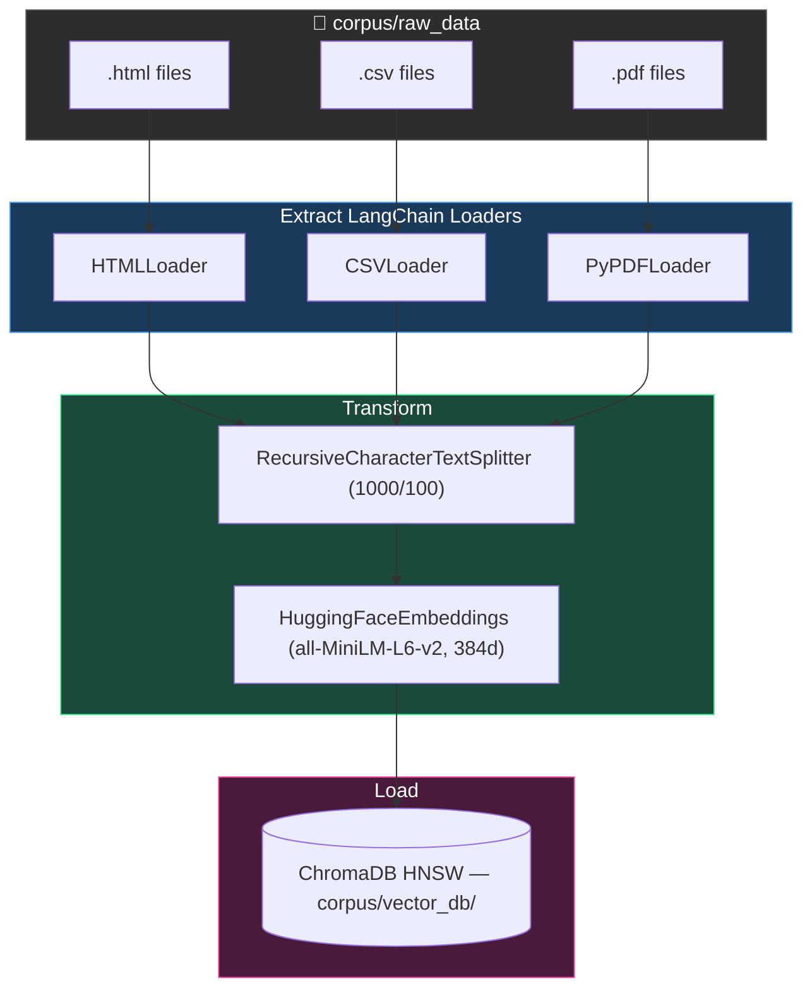

# Phase 2: Ingestion & Indexing

## Goal
Transform the raw files downloaded in Phase 1 into a searchable vector database.

## Conceptual Overview (ETL for RAG)
Phase 1 output raw HTML, CSV, and PDF files. Phase 2 builds the ETL pipeline to create a vector database for retrieval.

1.  **Extract**: Loaders read raw files (HTML, CSV, PDF) and convert them into standard `Document` objects (text + metadata).
2.  **Transform**: 
    *   **Chunking**: Split documents into smaller segments using a recursive character splitter. This keeps sentence boundaries intact and adds overlap to preserve context.
    *   **Embedding**: Run chunks through an encoder model (e.g., `all-MiniLM-L6-v2`) to generate dense vectors.
        *   **Encoder Model**: A neural network trained to understand context and semantic similarity, not just keyword matching.
        *   **Dense Vectors**: Fixed-size arrays of floating-point numbers (e.g., 384 dimensions) where closer proximity in space equals closer similarity in meaning.
3.  **Load**: Upsert vectors and metadata into an HNSW index (ChromaDB) for approximate nearest neighbor (ANN) search.
    *   **Upsert (Update + Insert)**: A database operation that updates an existing record if it exists, or inserts a new one if it doesn't. This ensures idempotency (running the script twice doesn't create duplicate entries).

## Architecture



## Recommended Directory Structure

We should move towards a `src` layout, which is a pattern standard in modern Python packaging because:

1.  **Enforces Installation**: It prevents you from accidentally importing local code without installing it (avoiding "it works on my machine" errors).
2.  **Cleaner Namespace**: Keeps the root directory for configuration (`pyproject.toml`, `README`) and tests, reducing clutter.
3.  **Explicit Imports**: Ensures that tests run against the installed package, mirroring how a user would use it.

```text
rag_stress_testing/
├── corpus/
│   ├── raw_data/          # (Existing) The downloaded files
│   └── vector_db/         # (New) Where the database lives on disk
├── src/
│   ├── ingestion/
│   │   ├── __init__.py
│   │   ├── loaders.py     # Classes to read HTML/CSV/PDF
│   │   └── processor.py   # Main pipeline script
│   ├── embedding/
│   │   ├── __init__.py
│   │   └── model.py       # Wrapper for embedding model
│   └── utils/
├── tests/
├── pyproject.toml 
└── README.md
```

## How to Proceed (Step-by-Step)

**Recommended Branch Strategy:**  
Start by creating a new branch: `feature/ingestion-pipeline`

### 1. Choose Your Stack

#### Orchestration Framework

| Tool | Pros | Cons |
|------|------|------|
| **LangChain** | Massive ecosystem, standard interface, rich document loaders/splitters | Bloated/over-abstracted, hard to debug, frequent breaking changes |
| **Haystack** | Explicit pipeline design (DAGs), Pythonic/readable, production-ready | Smaller ecosystem than LangChain |
| **Pure Python** | Maximum control, zero dependency bloat, easy debugging | Reinventing wheels, higher maintenance code |

**Recommendation**: **LangChain** — its `Community` document loaders and text splitters save days of work.

#### Vector Database

| Tool | Pros | Cons |
|------|------|------|
| **ChromaDB** | Open-source, in-process (no Docker), Python-native, simple storage/indexing | Newer project, SQLite/ClickHouse wrapper, scaling limits |
| **FAISS** | Gold standard for raw speed/efficiency | Index only — you manage text/metadata storage separately |
| **Qdrant** | Extremely fast (Rust), great filtering, production-grade | Requires separate service (Docker), more setup |

**Recommendation**: **ChromaDB** — simplest setup (`pip install chromadb`).

#### Embeddings Model

| Tool | Pros | Cons |
|------|------|------|
| **HuggingFace** (`all-MiniLM-L6-v2`) | Free, runs locally, data stays private, decent performance | Uses local CPU/GPU, need to manage model files |
| **OpenAI** (`text-embedding-3-small`) | Top-tier performance, simple API, no local compute | Paid, data privacy concerns, API latency |

**Recommendation**: **HuggingFace** — start local/free, upgrade later if needed.

### 2. Implement Loaders (`src/ingestion/loaders.py`)
We need specific logic for our file types:
- **HTML**: Use `BeautifulSoup` to strip tags and extract just the article text.
- **CSV**: Use `Pandas` to convert rows into text blocks (e.g., "Field X has value Y").
- **PDF**: Use `pypdf` or `pdfminer` to extract text content per page.

### 3. Implement Chunking
Use a "Recursive Character Text Splitter".
- **Chunk Size**: ~1000 characters (good for paragraphs).
- **Overlap**: ~100 characters (so context isn't lost at the edges).

### 4. Build the Database
Create a script (e.g., `process_data.py` or command) that:
1. Iterates through `corpus/raw_data`.
2. Checks if the file is already in the DB (to avoid duplicates).
3. Process, Embed, and Save.

### 5. Verify
Write a simple script to query the DB: "Tell me about the 2026 Severe Scenario" and ensure it returns relevant text chunks.
