# Phase 2: Ingestion & Indexing

## Goal
Transform the raw files downloaded in Phase 1 into a searchable vector database.

## Conceptual Overview (ETL for RAG)
Phase 1 output raw HTML, CSV, and PDF files. Phase 2 builds the ETL pipeline to create a vector database for retrieval.

1.  **Extract**: Loaders read raw files (HTML, CSV, PDF) and convert them into standard `Document` objects (text + metadata).
2.  **Transform**: 
    *   **Chunking**: Split documents into smaller segments using a recursive character splitter. This keeps sentence boundaries intact and adds overlap to preserve context.
    *   **Embedding**: Run chunks through an encoder model (e.g., `all-MiniLM-L6-v2`) to generate dense vectors.
        *   **Encoder Model**: A neural network trained to understand context and semantic similarity, not just keyword matching.
        *   **Dense Vectors**: Fixed-size arrays of floating-point numbers (e.g., 384 dimensions) where closer proximity in space equals closer similarity in meaning.
3.  **Load**: Upsert vectors and metadata into an HNSW index (ChromaDB) for approximate nearest neighbor (ANN) search.
    *   **Upsert (Update + Insert)**: A database operation that updates an existing record if it exists, or inserts a new one if it doesn't. This ensures idempotency (running the script twice doesn't create duplicate entries).

## Architecture

```mermaid
graph TD
    subgraph Input["📁 corpus/raw_data"]
        HTML[".html files"]
        CSV[".csv files"]
        PDF[".pdf files"]
    end

    subgraph Extract["Extract LangChain Loaders"]
        BS4["HTMLLoader"]
        PD["CSVLoader"]
        PY["PyPDFLoader"]
    end

    subgraph Transform["Transform"]
        Chunk["RecursiveCharacterTextSplitter (1000/100)"]
        Embed["HuggingFaceEmbeddings (all-MiniLM-L6-v2, 384d)"]
    end

    subgraph Load["Load"]
        Chroma[("ChromaDB HNSW — corpus/vector_db/")]
    end

    HTML --> BS4
    CSV --> PD
    PDF --> PY

    BS4 --> Chunk
    PD --> Chunk
    PY --> Chunk

    Chunk --> Embed
    Embed --> Chroma

    style Input fill:#2d2d2d,stroke:#555,color:#fff
    style Extract fill:#1a3a5c,stroke:#4a9eed,color:#fff
    style Transform fill:#1a4a3a,stroke:#4aed9e,color:#fff
    style Load fill:#4a1a3a,stroke:#ed4a9e,color:#fff
```



## Recommended Directory Structure

We should move towards a `src` layout, which is a pattern standard in modern Python packaging because:

1.  **Enforces Installation**: It prevents you from accidentally importing local code without installing it (avoiding "it works on my machine" errors).
2.  **Cleaner Namespace**: Keeps the root directory for configuration (`pyproject.toml`, `README`) and tests, reducing clutter.
3.  **Explicit Imports**: Ensures that tests run against the installed package, mirroring how a user would use it.

```text
rag_stress_testing/
├── corpus/
│   ├── raw_data/          # (Existing) The downloaded files
│   └── vector_db/         # (New) Where the database lives on disk
├── src/
│   ├── ingestion/
│   │   ├── __init__.py
│   │   ├── loaders.py     # Classes to read HTML/CSV/PDF
│   │   └── processor.py   # Main pipeline script
│   ├── embedding/
│   │   ├── __init__.py
│   │   └── model.py       # Wrapper for embedding model
│   └── utils/
├── tests/
├── pyproject.toml 
└── README.md
```

## How to Proceed (Step-by-Step)

**Recommended Branch Strategy:**  
Start by creating a new branch: `feature/ingestion-pipeline`

### 1. Choose Your Stack

#### Orchestration Framework

| Tool | Pros | Cons |
|------|------|------|
| **LangChain** | Massive ecosystem, standard interface, rich document loaders/splitters | Bloated/over-abstracted, hard to debug, frequent breaking changes |
| **Haystack** | Explicit pipeline design (DAGs), Pythonic/readable, production-ready | Smaller ecosystem than LangChain |
| **Pure Python** | Maximum control, zero dependency bloat, easy debugging | Reinventing wheels, higher maintenance code |

**Recommendation**: **LangChain** — its `Community` document loaders and text splitters save days of work.

#### Vector Database

| Tool | Pros | Cons |
|------|------|------|
| **ChromaDB** | Open-source, in-process (no Docker), Python-native, simple storage/indexing | Newer project, SQLite/ClickHouse wrapper, scaling limits |
| **FAISS** | Gold standard for raw speed/efficiency | Index only — you manage text/metadata storage separately |
| **Qdrant** | Extremely fast (Rust), great filtering, production-grade | Requires separate service (Docker), more setup |

**Recommendation**: **ChromaDB** — simplest setup (`pip install chromadb`).

#### Embeddings Model

| Tool | Pros | Cons |
|------|------|------|
| **HuggingFace** (`all-MiniLM-L6-v2`) | Free, runs locally, data stays private, decent performance | Uses local CPU/GPU, need to manage model files |
| **OpenAI** (`text-embedding-3-small`) | Top-tier performance, simple API, no local compute | Paid, data privacy concerns, API latency |

**Recommendation**: **HuggingFace** — start local/free, upgrade later if needed.

### 2. Implement Loaders (`src/ingestion/loaders.py`)
We need specific logic for our file types:
- **HTML**: Use `BeautifulSoup` to strip tags and extract just the article text.
- **CSV**: Use `Pandas` to convert rows into text blocks (e.g., "Field X has value Y").
- **PDF**: Use `pypdf` or `pdfminer` to extract text content per page.

### 3. Implement Chunking
Use a "Recursive Character Text Splitter".
- **Chunk Size**: ~1000 characters (good for paragraphs).
- **Overlap**: ~100 characters (so context isn't lost at the edges).

### 4. Build the Database
Create a script (e.g., `process_data.py` or command) that:
1. Iterates through `corpus/raw_data`.
2. Checks if the file is already in the DB (to avoid duplicates).
3. Process, Embed, and Save.

### 5. Verify
Write a simple script to query the DB: "Tell me about the 2026 Severe Scenario" and ensure it returns relevant text chunks.


# embedding.py (Detailed Implementation Notes)

Chunk IDs from metadata.csv
metadata.csv has a doc_id (Crockford Base32 ULID) and local_path per downloaded file. The join logic would be:

Load metadata.csv into a dict keyed by local_path (e.g. {"corpus/raw_data/credit_risk_models.pdf": {"doc_id": "1JA8WZFYSY0", ...}}).
Each chunk's .metadata["source"] already contains the same local_path value (set by loaders.py line 68).
For each chunk, look up its doc_id via source, then generate "{doc_id}_chunk_{n}" — e.g. "1JA8WZFYSY0_chunk_0042". The n is a zero-padded sequential counter per source file.
This gives you fully traceable IDs: given any chunk in ChromaDB, you can trace it back to the exact downloaded file in metadata.csv and its original URL.

Batching Explained
ChromaDB's upsert (and add) has a maximum batch size determined by the underlying SQLite version's parameter limit. On most systems this is around 5,461 records per call (sometimes up to ~41,666). If you try to upsert more than that in a single call, ChromaDB raises an error.

Your corpus has ~40 files, many are large PDFs (600+ pages). At 1,000-char chunks, a single PDF could produce thousands of chunks. The total could easily exceed the batch limit.

The fix is simple: slice the chunks list into batches (e.g. 500 at a time) and call collection.upsert() in a loop. ChromaDB provides client.max_batch_size to query the actual limit at runtime, or you can use their chromadb.utils.batch_utils.create_batches helper. A manual loop with a conservative batch size of 500 is more transparent and keeps you in control.

Updated Steps (with langchain-huggingface)
Add dependency — run uv add langchain-huggingface. This pulls in sentence-transformers + torch transitively and provides HuggingFaceEmbeddings.

Create src/embedding/__init__.py and src/embedding/model.py — In model.py, define:

A get_embedding_function() that returns a HuggingFaceEmbeddings(model_name="all-MiniLM-L6-v2") instance.
A get_or_create_collection() that creates a chromadb.PersistentClient(path="corpus/vector_db/") and calls get_or_create_collection("stress_test_docs").
A _load_doc_id_map() helper that reads metadata.csv and returns a dict of {local_path: doc_id}.
An embed_and_store(chunks, batch_size=500) function that: (a) builds chunk IDs as {doc_id}_chunk_{n:04d} by joining each chunk's source metadata against the CSV map, (b) calls embedding_fn.embed_documents(texts) to get vectors, (c) loops through batches of batch_size calling collection.upsert(ids, embeddings, documents, metadatas), (d) logs progress per batch.
Extend processor.run() — After the existing chunk_documents() call (line 87), import and call embed_and_store(chunks) from the new module. Update the docstring to reflect steps 3–4.

Add corpus/vector_db/ to .gitignore — alongside the existing corpus/raw_data/ entry.

Create tests/test_embedding.py — Mock HuggingFaceEmbeddings, chromadb.PersistentClient, and the CSV read. Test that chunk IDs follow the {doc_id}_chunk_{n} format, that batching splits correctly, and that upsert is called the expected number of times.

Further Considerations
Chunks with no matching doc_id — If a file in raw_data/ wasn't downloaded via downloader.py (so it's missing from metadata.csv), the lookup will fail. Recommend falling back to a hash of the source path, e.g. "unknown_{hash}_chunk_{n}", and logging a warning.
Enriching ChromaDB metadata — Beyond source, you could also merge in title, author, and source_url from metadata.csv into each chunk's ChromaDB metadata, enabling filtered queries like where={"author": "www.federalreserve.gov"}.