# Phase 2: Ingestion & Indexing

## Goal
Transform the raw files downloaded in Phase 1 into a searchable vector database.

## Conceptual Overview (ETL for RAG)
Phase 1 output raw HTML, CSV, and PDF files. Phase 2 builds the ETL pipeline to create a vector database for retrieval.

1.  **Extract**: Loaders read raw files (HTML, CSV, PDF) and convert them into standard `Document` objects (text + metadata).
2.  **Transform**: 
    *   **Chunking**: Split documents into smaller segments using a recursive character splitter. This keeps sentence boundaries intact and adds overlap to preserve context.
    *   **Embedding**: Run chunks through an encoder model (e.g., `all-MiniLM-L6-v2`) to generate dense vectors.
        *   **Encoder Model**: A neural network trained to understand context and semantic similarity, not just keyword matching.
        *   **Dense Vectors**: Fixed-size arrays of floating-point numbers (e.g., 384 dimensions) where closer proximity in space equals closer similarity in meaning.
3.  **Load**: Upsert vectors and metadata into an HNSW index (ChromaDB) for approximate nearest neighbor (ANN) search.
    *   **Upsert (Update + Insert)**: A database operation that updates an existing record if it exists, or inserts a new one if it doesn't. This ensures idempotency (running the script twice doesn't create duplicate entries).

## Architecture

```mermaid
graph TD
    subgraph Input["📁 corpus/raw_data"]
        HTML[".html files"]
        CSV[".csv files"]
        PDF[".pdf files"]
    end

    subgraph Extract["Extract LangChain Loaders"]
        BS4["HTMLLoader"]
        PD["CSVLoader"]
        PY["PyPDFLoader"]
    end

    subgraph Transform["Transform"]
        Chunk["RecursiveCharacterTextSplitter (1000/100)"]
        Embed["HuggingFaceEmbeddings (all-MiniLM-L6-v2, 384d)"]
    end

    subgraph Load["Load"]
        Chroma[("ChromaDB HNSW — corpus/vector_db/")]
    end

    HTML --> BS4
    CSV --> PD
    PDF --> PY

    BS4 --> Chunk
    PD --> Chunk
    PY --> Chunk

    Chunk --> Embed
    Embed --> Chroma

    style Input fill:#2d2d2d,stroke:#555,color:#fff
    style Extract fill:#1a3a5c,stroke:#4a9eed,color:#fff
    style Transform fill:#1a4a3a,stroke:#4aed9e,color:#fff
    style Load fill:#4a1a3a,stroke:#ed4a9e,color:#fff
```



## Recommended Directory Structure

We should move towards a `src` layout, which is a pattern standard in modern Python packaging because:

1.  **Enforces Installation**: It prevents you from accidentally importing local code without installing it (avoiding "it works on my machine" errors).
2.  **Cleaner Namespace**: Keeps the root directory for configuration (`pyproject.toml`, `README`) and tests, reducing clutter.
3.  **Explicit Imports**: Ensures that tests run against the installed package, mirroring how a user would use it.

```text
rag_stress_testing/
├── corpus/
│   ├── raw_data/          # (Existing) The downloaded files
│   └── vector_db/         # (New) Where the database lives on disk
├── src/
│   ├── ingestion/
│   │   ├── __init__.py
│   │   ├── loaders.py     # Classes to read HTML/CSV/PDF
│   │   └── processor.py   # Main pipeline script
│   ├── embedding/
│   │   ├── __init__.py
│   │   └── model.py       # Wrapper for embedding model
│   └── utils/
├── tests/
├── pyproject.toml 
└── README.md
```

## How to Proceed (Step-by-Step)

**Recommended Branch Strategy:**  
Start by creating a new branch: `feature/ingestion-pipeline`

### 1. Choose Your Stack

#### Orchestration Framework

| Tool | Pros | Cons |
|------|------|------|
| **LangChain** | Massive ecosystem, standard interface, rich document loaders/splitters | Bloated/over-abstracted, hard to debug, frequent breaking changes |
| **Haystack** | Explicit pipeline design (DAGs), Pythonic/readable, production-ready | Smaller ecosystem than LangChain |
| **Pure Python** | Maximum control, zero dependency bloat, easy debugging | Reinventing wheels, higher maintenance code |

**Recommendation**: **LangChain** — its `Community` document loaders and text splitters save days of work.

#### Vector Database

| Tool | Pros | Cons |
|------|------|------|
| **ChromaDB** | Open-source, in-process (no Docker), Python-native, simple storage/indexing | Newer project, SQLite/ClickHouse wrapper, scaling limits |
| **FAISS** | Gold standard for raw speed/efficiency | Index only — you manage text/metadata storage separately |
| **Qdrant** | Extremely fast (Rust), great filtering, production-grade | Requires separate service (Docker), more setup |

**Recommendation**: **ChromaDB** — simplest setup (`pip install chromadb`).

#### Embeddings Model

| Tool | Pros | Cons |
|------|------|------|
| **HuggingFace** (`all-MiniLM-L6-v2`) | Free, runs locally, data stays private, decent performance | Uses local CPU/GPU, need to manage model files |
| **OpenAI** (`text-embedding-3-small`) | Top-tier performance, simple API, no local compute | Paid, data privacy concerns, API latency |

**Recommendation**: **HuggingFace** — start local/free, upgrade later if needed.

### 2. Implement Loaders (`src/ingestion/loaders.py`) ✅
Implemented via LangChain Community loaders with a strategy-pattern `LOADER_MAP` that maps 10 file extensions to their loader class. `load_directory()` iterates `corpus/raw_data/`, calls `load_file()` per supported file, and returns a flat list of `Document` objects with `.page_content` and `.metadata["source"]`.

### 3. Implement Chunking ✅
Implemented in `processor.py` → `chunk_documents()` using `RecursiveCharacterTextSplitter`.
- **Chunk Size**: 1,000 characters (~200–300 words).
- **Overlap**: 100 characters.
Each chunk inherits its parent document's metadata.

### 4. Embed and Store ✅
Implemented in `src/embedding/model.py` → `embed_and_store()`. Called as Step 3 in `processor.run()` after chunking.

#### Embedding
- **Library**: `langchain-huggingface` (`HuggingFaceEmbeddings` wrapper around `sentence-transformers`).
- **Model**: `all-MiniLM-L6-v2` — 384-dimensional dense vectors. Downloaded on first run and cached in `~/.cache/huggingface/`.
- All chunk texts are embedded in a single `embed_documents()` call.

#### Chunk ID Strategy
Fully traceable, idempotent IDs derived from `corpus/metadata.csv`:
1. `load_doc_id_map()` reads the CSV into a dict keyed by `local_path` (e.g. `{"corpus/raw_data/credit_risk_models.pdf": {"doc_id": "1JA8WZFYSY0", ...}}`).
2. Each chunk's `.metadata["source"]` is the same `local_path` value (set by `loaders.py`), so the join is a simple dict lookup.
3. IDs follow the format `{doc_id}_chunk_{n:04d}` — e.g. `"1JA8WZFYSY0_chunk_0042"`. The `n` is a zero-padded sequential counter per source file.

**Hash fallback**: If a source file has no entry in `metadata.csv` (e.g. it was manually placed in `raw_data/`), `_fallback_doc_id()` generates a deterministic 11-character SHA-256 hex prefix of the source path instead. A warning is logged.

#### Metadata Enrichment
Each chunk's ChromaDB metadata starts with the loader-provided fields (`source`, `page`, `row`, etc.) and is then enriched with fields from `metadata.csv`:
- `doc_id`, `title`, `author`, `source_url`, `source_type`

This enables filtered queries like `where={"author": "www.federalreserve.gov"}` or `where={"source_type": "pdf"}`.

#### Batch Upserts
ChromaDB's underlying SQLite backend limits the number of parameters per statement (~5,461 records on most systems). The corpus can easily exceed this (a 600-page PDF at 1,000-char chunks produces thousands of chunks).

`embed_and_store()` slices the upsert into batches of 500 (configurable via `batch_size`) and logs progress per batch. This is a manual loop rather than using `chromadb.utils.batch_utils.create_batches` for transparency.

#### ChromaDB Configuration
- **Mode**: Embedded/in-process via `chromadb.PersistentClient(path="corpus/vector_db/")`.
- **Collection**: `"stress_test_docs"`, created via `get_or_create_collection()`.
- **Index**: HNSW (ChromaDB default) for approximate nearest neighbor search.
- `corpus/vector_db/` is gitignored.

### 5. Verify
Write a simple script to query the DB: "Tell me about the 2026 Severe Scenario" and ensure it returns relevant text chunks.

## Implementation Reference

### Dependencies Added
- `langchain-huggingface` — LangChain wrapper for HuggingFace embedding models. Pulls in `sentence-transformers` + `torch` transitively.
- `chromadb` — already declared in Phase 1.

### Files Created
| File | Purpose |
|------|---------|
| `src/embedding/__init__.py` | Package marker |
| `src/embedding/model.py` | `get_embedding_function()`, `get_or_create_collection()`, `load_doc_id_map()`, `_fallback_doc_id()`, `embed_and_store()` |
| `tests/test_embedding.py` | 16 unit tests (mocked — no model download or disk I/O) |

### Files Modified
| File | Change |
|------|--------|
| `src/ingestion/processor.py` | Added `embed_and_store()` call as Step 3 after chunking |
| `.gitignore` | Added `corpus/vector_db/` |
| `pyproject.toml` | `langchain-huggingface` added to dependencies |

### Module Constants (`src/embedding/model.py`)
| Constant | Value |
|----------|-------|
| `MODEL_NAME` | `"all-MiniLM-L6-v2"` |
| `VECTOR_DB_DIR` | `"corpus/vector_db"` |
| `COLLECTION_NAME` | `"stress_test_docs"` |
| `METADATA_CSV` | `"corpus/metadata.csv"` |
| `DEFAULT_BATCH_SIZE` | `500` |

### Pipeline Flow (`processor.run()`)
```text
Step 1: load_directory()        → list[Document]      (loaders.py)
Step 2: chunk_documents(docs)   → list[Document]      (processor.py)
Step 3: embed_and_store(chunks) → int (count upserted) (model.py)
```