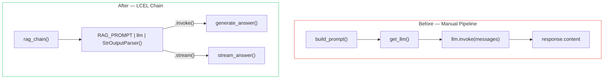
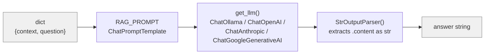
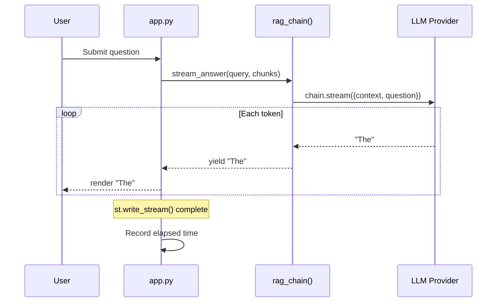
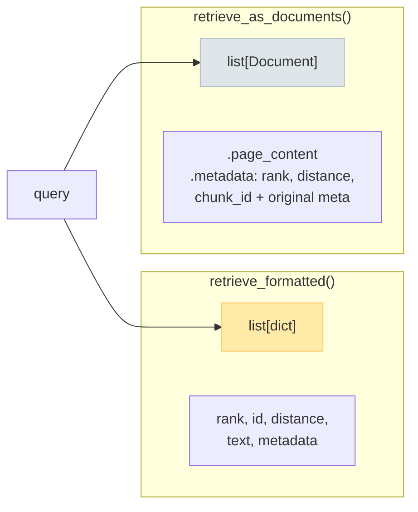
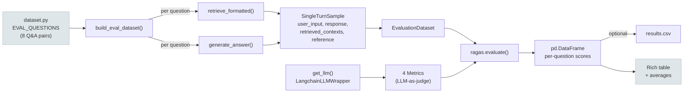
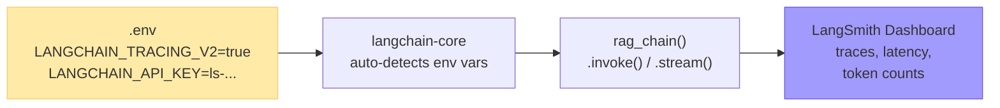

# Refactor: LCEL Chain, Streaming, ragas Evaluation & LangSmith

**Branch:** `feature/ui`
**Date:** February 2026

This document describes the architectural refactor that rewrote the generation pipeline around LangChain Expression Language (LCEL), added token-by-token streaming, integrated ragas for automated evaluation, and enabled LangSmith tracing.

---

## Table of Contents

1. [Motivation](#motivation)
2. [Summary of Changes](#summary-of-changes)
3. [LCEL Chain Rewrite](#lcel-chain-rewrite)
4. [Token-by-Token Streaming](#token-by-token-streaming)
5. [Document-Based Retrieval API](#document-based-retrieval-api)
6. [ragas Evaluation Module](#ragas-evaluation-module)
7. [LangSmith Tracing](#langsmith-tracing)
8. [Test Strategy Overhaul](#test-strategy-overhaul)
9. [Files Changed](#files-changed)
10. [Dependency Changes](#dependency-changes)
11. [Migration Notes](#migration-notes)

---

## Motivation

The original generation pipeline had several limitations:

| Problem | Impact |
|---------|--------|
| Manual prompt assembly via string formatting | Tight coupling between prompt construction and LLM invocation |
| No streaming support | 30+ second waits with only a spinner — poor UX on slow hardware |
| Threaded timer in Streamlit for progress display | Complex threading code, race conditions, no partial output |
| No automated evaluation | Quality measured by manual inspection only |
| No observability | Blind to prompt construction, token counts, and latency |

The refactor addresses all five by adopting LCEL as the composable pipeline primitive.

---

## Summary of Changes



### At a glance

| Area | Before | After |
|------|--------|-------|
| **Chain** | `build_prompt()` → `llm.invoke(messages)` → `response.content` | `RAG_PROMPT \| llm \| StrOutputParser()` |
| **Streamlit** | `threading.Thread` + timer polling | `st.write_stream(stream_answer(...))` |
| **Retrieval** | `retrieve_formatted()` → `list[dict]` only | + `retrieve_as_documents()` → `list[Document]` |
| **Evaluation** | Manual | ragas 0.4.x: 4 metrics, CLI runner, CSV export |
| **Observability** | None | LangSmith tracing (zero-config via env vars) |
| **Tests** | Mock `get_llm()` | Mock `rag_chain()` (avoids pydantic/StrOutputParser issues) |

---

## LCEL Chain Rewrite

### What is LCEL?

LangChain Expression Language (LCEL) lets you compose pipeline stages with the `|` (pipe) operator. Each stage is a `Runnable` — it has `.invoke()`, `.stream()`, and `.batch()` methods.

### The chain

```python
# src/generation/llm.py

RAG_PROMPT = ChatPromptTemplate.from_messages([
    ("system", SYSTEM_PROMPT),
    ("human", "CONTEXT:\n{context}\n\nQUESTION:\n{question}\n\nANSWER:"),
])

def rag_chain(model, temperature, provider):
    llm = get_llm(model=model, temperature=temperature, provider=provider)
    return RAG_PROMPT | llm | StrOutputParser()
```



### How it's consumed

| Entry point | Method | Use case |
|-------------|--------|----------|
| `generate_answer()` | `chain.invoke()` | CLI, evaluation — returns full answer |
| `stream_answer()` | `chain.stream()` | Streamlit UI — yields token-by-token |
| `ask()` | calls `generate_answer()` | End-to-end convenience wrapper |

### Key functions in `llm.py`

| Function | Purpose |
|----------|---------|
| `rag_chain()` | Builds and returns `RAG_PROMPT \| llm \| StrOutputParser()` |
| `format_context()` | Formats `list[dict]` chunks into a context string (backward compat) |
| `format_docs()` | Formats `list[Document]` into a context string (LCEL-native) |
| `generate_answer()` | Invokes the chain synchronously, wraps connection errors |
| `stream_answer()` | Yields from `chain.stream()` — `Iterator[str]` |

---

## Token-by-Token Streaming

### Before: threaded timer

```python
# ❌ Old app.py — threading + polling
thread = threading.Thread(target=_generate, daemon=True)
thread.start()
while thread.is_alive():
    timer_placeholder.markdown(f"🤖 Generating… {elapsed}")
    time.sleep(0.5)
st.markdown(answer)
```

### After: `st.write_stream()`

```python
# ✅ New app.py — native streaming
answer = st.write_stream(
    stream_answer(query, chunks, model=model,
                  temperature=temperature, provider=provider)
)
```



### What changed in `app.py`

- Removed `import threading`
- Replaced `generate_answer` import with `stream_answer`
- Replaced 40 lines of threaded timer code with 6 lines using `st.write_stream()`
- Error handling preserved (`ConnectionError`, `ImportError`, generic)

---

## Document-Based Retrieval API

### New function: `retrieve_as_documents()`

Added to `src/retrieval/query.py` alongside the existing `retrieve_formatted()`:

```python
def retrieve_as_documents(query, n_results=5, ...) -> list[Document]:
    """LCEL-friendly counterpart of retrieve_formatted().
    Returns LangChain Document objects with enriched metadata."""
```



Each `Document.metadata` dict includes:

| Key | Source |
|-----|--------|
| `rank` | Position in results (1-based) |
| `distance` | Cosine distance from query |
| `chunk_id` | ChromaDB chunk ID |
| `title`, `source`, `doc_id`, … | Original ChromaDB metadata |

### Why both APIs?

- `retrieve_formatted()` is used by the CLI, logging, and evaluation (dict-based)
- `retrieve_as_documents()` is the LCEL-native path, used by `ask()` and returned in its output dict

The `ask()` function now returns both:

```python
return {
    "query": query,
    "answer": answer,
    "chunks": chunks,        # list[dict]  — backward compat
    "documents": documents,  # list[Document] — new
    "model": model,
    "provider": provider,
}
```

---

## ragas Evaluation Module

### New files

| File | Purpose |
|------|---------|
| `src/evaluation/__init__.py` | Package marker |
| `src/evaluation/dataset.py` | 8 curated Q&A pairs |
| `src/evaluation/evaluate.py` | CLI runner with ragas metrics |
| `tests/test_evaluation.py` | 7 unit tests |

### Metrics

| Metric | Class | What it scores |
|--------|-------|----------------|
| Faithfulness | `ragas.metrics._faithfulness.Faithfulness` | Is the answer grounded in retrieved context? |
| Response Relevancy | `ragas.metrics._answer_relevance.ResponseRelevancy` | Does the answer address the question? |
| LLM Context Recall | `ragas.metrics._context_recall.LLMContextRecall` | Did retrieval find the needed information? |
| Factual Correctness | `ragas.metrics._factual_correctness.FactualCorrectness` | Does the answer match the ground truth? |

### Evaluation pipeline



### CLI usage

```bash
# Default: uses config.txt provider/model
uv run python -m src.evaluation.evaluate

# Override provider and model
uv run python -m src.evaluation.evaluate --provider openai --model gpt-4o-mini

# Export to CSV
uv run python -m src.evaluation.evaluate --top-k 10 --out results.csv
```

### ragas API notes (v0.4.x)

- Uses `SingleTurnSample` (not the deprecated `Dataset` API)
- Field names: `user_input`, `response`, `retrieved_contexts`, `reference`
- Metrics imported from non-deprecated paths (`ragas.metrics._faithfulness`, etc.)

---

## LangSmith Tracing

### Setup

Zero-config — just set two env vars in `.env`:

```dotenv
LANGCHAIN_TRACING_V2=true
LANGCHAIN_API_KEY=ls-...
```

### How it works

`langsmith` is already installed as a transitive dependency of `langchain-core`. When `LANGCHAIN_TRACING_V2=true` is detected, every LCEL chain invocation is automatically traced:



No code instrumentation needed. Every `generate_answer()`, `stream_answer()`, and `ask()` call is traced.

---

## Test Strategy Overhaul

### The mocking problem

The original tests mocked `get_llm()` and expected to call `.invoke()` on the returned `MagicMock`. After the LCEL rewrite, this breaks:

```
RAG_PROMPT | mock_llm | StrOutputParser()
                            ↑
              StrOutputParser expects a string or AIMessage,
              but MagicMock.__or__() returns another MagicMock
              → pydantic validation error
```

### Solution: mock `rag_chain()` instead

```python
# ❌ Before — breaks with LCEL
@patch("src.generation.llm.get_llm")
def test_returns_answer(self, mock_get_llm):
    mock_llm = MagicMock()
    mock_llm.invoke.return_value = MagicMock(content="answer")
    mock_get_llm.return_value = mock_llm

# ✅ After — mock the whole chain
@patch("src.generation.llm.rag_chain")
def test_returns_answer(self, mock_rag_chain):
    mock_runnable = MagicMock()
    mock_runnable.invoke.return_value = "answer"
    mock_rag_chain.return_value = mock_runnable
```

### New test classes

| File | Class | Tests | What it covers |
|------|-------|-------|----------------|
| `test_generation.py` | `TestFormatDocs` | 5 | Document-based context formatting |
| `test_generation.py` | `TestRagChain` | 3 | Chain construction and provider forwarding |
| `test_generation.py` | `TestStreamAnswer` | 3 | Streaming iterator behavior |
| `test_generation.py` | `TestGenerateAnswer` | 6 | Updated to mock `rag_chain` (was `get_llm`) |
| `test_generation.py` | `TestAsk` | 3 | Updated to handle `documents` key |
| `test_retrieval.py` | `TestRetrieveAsDocuments` | 4 | Document objects, metadata, empty results |
| `test_evaluation.py` | `TestEvalDataset` | 4 | Dataset structure validation |
| `test_evaluation.py` | `TestBuildEvalDataset` | 3 | Pipeline mocking, error handling |

### Test results

```
163 passed, 1 failed (pre-existing), 1 warning
```

The single failure (`test_market_risk_models`) is a pre-existing integration test that depends on specific vector DB content — unrelated to this refactor.

---

## Files Changed

### New files

| File | Purpose |
|------|---------|
| `src/ingestion/pdf_section_splitter.py` | Section-aware PDF splitter for structured model documentation |
| `src/evaluation/__init__.py` | Package marker (empty) |
| `src/evaluation/dataset.py` | 8 curated Q&A pairs for ragas evaluation |
| `src/evaluation/evaluate.py` | CLI runner: `build_eval_dataset()` + `run_evaluation()` |
| `tests/test_pdf_section_splitter.py` | 27 unit tests for the section-aware splitter |
| `tests/test_evaluation.py` | 7 unit tests for the evaluation module |

### Modified files

| File | Changes |
|------|---------|
| `src/ingestion/loaders.py` | Routes structured PDFs to `pdf_section_splitter.py` via `has_section_headers()` probe |
| `src/generation/llm.py` | LCEL chain (`rag_chain()`, `stream_answer()`, `format_docs()`); `generate_answer()` uses chain internally; `ask()` returns `documents` key |
| `src/retrieval/query.py` | Added `retrieve_as_documents()` returning `list[Document]` |
| `app.py` | Replaced threaded timer with `st.write_stream(stream_answer(...))`, removed `threading` import |
| `.env.example` | Added `LANGCHAIN_TRACING_V2` and `LANGCHAIN_API_KEY` |
| `pyproject.toml` | Added `ragas>=0.4.3` and `datasets>=4.5.0` |
| `tests/test_generation.py` | Rewrote `TestGenerateAnswer` to mock `rag_chain`; added `TestFormatDocs`, `TestRagChain`, `TestStreamAnswer`; updated `TestAsk` for `documents` key |
| `tests/test_retrieval.py` | Added `TestRetrieveAsDocuments` (4 tests) |
| `README.md` | Added Evaluation, LangSmith, streaming sections; updated project tree and roadmap |
| `docs/architecture.md` | Updated diagrams and ADRs (002–005) for LCEL, ragas, LangSmith, streaming |

---

## Dependency Changes

| Package | Version | Why |
|---------|---------|-----|
| `ragas` | ≥ 0.4.3 | Automated RAG evaluation (Faithfulness, Relevancy, Recall, Correctness) |
| `datasets` | ≥ 4.5.0 | Required by ragas for dataset management |
| `langsmith` | (transitive) | Already installed via `langchain-core` — zero-config tracing |

Install with:

```bash
uv sync
```

---

## Migration Notes

### For callers of `ask()`

The return dict now includes a `"documents"` key:

```python
result = ask("question")
result["documents"]  # list[Document] — new
result["chunks"]     # list[dict] — unchanged
```

### For callers of `generate_answer()`

No API change — still takes `(query, chunks)` and returns `str`. Internally it now uses `rag_chain().invoke()` instead of direct `llm.invoke()`.

### For tests that mock `get_llm()`

If you have custom tests that mock `get_llm()` to test `generate_answer()` or `stream_answer()`, switch to mocking `rag_chain()`:

```python
@patch("src.generation.llm.rag_chain")
def test_something(self, mock_chain):
    mock_runnable = MagicMock()
    mock_runnable.invoke.return_value = "answer"
    mock_chain.return_value = mock_runnable
```

### For `.env` files

Add the LangSmith section if you want tracing:

```dotenv
LANGCHAIN_TRACING_V2=true
LANGCHAIN_API_KEY=ls-...
```
